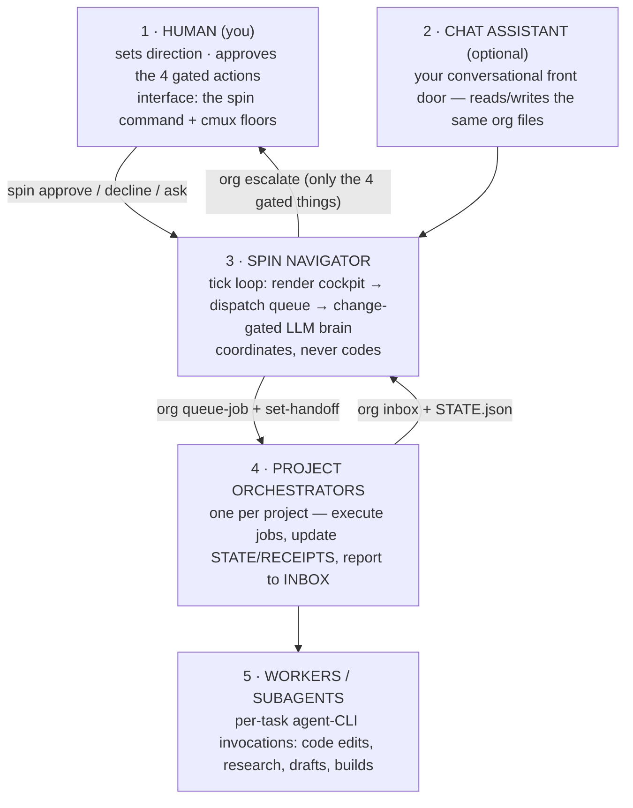

<div align="center">

# 🌀 SPIN

### Super Pi Interoperable Navigator

**A file-based AI organization that runs your projects while you sleep — gated on the four things that actually matter.**

[](https://github.com/claudiaclawdbot/spin/actions/workflows/ci.yml)
[](https://claudiaclawdbot.github.io/spin/)
[](LICENSE)


</div>

---

SPIN is the **plant around your coding-agent CLIs.** A single Navigator loop coordinates per-project agent "floors" inside [cmux](https://cmux.io), dispatches work to detached background jobs run by whichever agent CLI is available (Codex CLI → Claude Code → Gemini CLI → Ollama, with automatic fallback), and talks to you through one command: `spin`. Everything the org knows, decides, and does lives in plain files you can read, grep, and audit.

```
you ──spin approve──▶ APPROVALS.md ──▶ ┌──────────────────┐ ──▶ AGENT_QUEUE.json ──▶ detached agent jobs
                                       │   SPIN Navigator  │                          (run by an agent CLI)
you ◀── spin status ◀── HUMAN_QUEUE ◀──│   tick loop       │ ◀── INBOX.md ◀────────── project receipts
                                       └──────────────────┘
```

## What the name means

- **Super** — combines a bunch of cutting-edge dev tools into one harness that works *with* you: you can track it, and it reports back to you.
- **Pi** — the agentic backbone. Specifically **[oh-my-pi](https://omp.sh) (`omp`)**: every floor agent and interactive session runs on it. The engine SPIN is built around — and the letters at the heart of the name.
- **Interoperable** — swap LLMs on the fly, plug-and-play. Because all state and memory live in **plain files**, any agent CLI (Claude, Codex, Gemini, Ollama) picks up the same context. No lock-in.
- **Navigator** — the whole system, steering. Maximally legible for **humans** (live floors, status boards) and ordered for **agents** (clean files, validated verbs).

## Install in 30 seconds

```bash
git clone https://github.com/claudiaclawdbot/spin.git ~/spin
cd ~/spin && ./install.sh          # installs missing deps, seeds runtime files, links `spin` + `org`

spin doctor                        # confirm your setup
scripts/bootstrap-project.sh my-app    # register your first project
spin start                         # launch the Navigator loop
spin                               # check on it any time
```

One-liner (review the script first, like any `curl | bash`):

```bash
curl -fsSL https://raw.githubusercontent.com/claudiaclawdbot/spin/main/spin-bootstrap.sh | bash
```

**Requirements:**

- **Required** — macOS/Linux, `bash`, `node`, and at least one agent CLI on `PATH`: `claude` (Claude Code), `codex` (OpenAI Codex CLI), `gemini` (Google Gemini CLI), or `ollama` (local models). With just these, SPIN runs **headless** — the Navigator ticks and dispatches background jobs straight to the agent CLIs.
- **[`omp`](https://omp.sh) (oh-my-pi) — the interactive backbone.** SPIN is built around it: every floor agent (the Navigator you chat with, each project's live REPL, the delegate-and-watch path) is an omp session. It's where the name comes from — oh-my-**pi** → `OMP_HARNESS.json` → the **Pi** in SPIN. Strongly recommended; only the headless dispatch path can do without it.
- **[cmux](https://cmux.io) — the display.** The visual workspace that shows the floors, status chips, and live boards. Genuinely optional: omp floors work without it, just less visibly.

## Why SPIN exists

Running multiple AI-driven projects from chat sessions doesn't scale: context evaporates, agents step on each other, quotas burn silently, and you become the message bus. SPIN replaces that with a small, inspectable org:

- **One Navigator loop** — it claims a lock file at startup, so a second accidental launch just prints "already running" and exits instead of silently doubling your LLM spend.
- **A brain that only thinks when something changed** — the LLM runs only when watched inputs move (content hash, not mtime). An idle org costs a couple of LLM calls a day.
- **Detached background jobs** for real work — cmux is *display only* (a hard-won lesson; see [docs/LESSONS.md](docs/LESSONS.md)).
- **State changed through a CLI, never hand-edited** — agents call `org queue-job …`, `org set-state …`; the verbs validate, lock, and append so a mistyped bracket can't corrupt the queue.
- **Four hard gates** — SPIN acts freely on local, reversible work and stops for exactly four things: external sends, spending money, production deploys, pushes to protected repos.
- **Receipts for everything** — every brain run and job writes an append-only audit trail.

## The cast (read this first — the names overlap confusingly)

Several of these are both a product and a model family. Here they always mean the **CLI tool on your PATH**:

| Name | What it actually is | Role in SPIN |
|---|---|---|
| **SPIN** (this repo) | a bash+node orchestration layer — no models of its own | schedules, routes, budgets, gates, and audits the work |
| [**`omp`**](https://omp.sh) (oh-my-pi) | an interactive coding-agent CLI | the **interactive backbone** — every floor agent is an omp session (the Navigator you chat with, each project's REPL); the **Pi** in SPIN |
| **`codex`** / **`claude`** / **`gemini`** | headless-capable coding-agent CLIs, each wrapping its vendor's models | the **job workers** — the dispatcher spawns one per queued job, in waterfall order |
| **`ollama`** | a local model runtime | last-resort fallback when every cloud CLI is rate-limit benched |
| [**cmux**](https://cmux.io) | a terminal multiplexer with a GUI + control socket | **display only** — floors, status chips, live boards; never executes jobs |

The Navigator's "brain" is not a separate program: it's one LLM invocation per tick (via the same waterfall, `claude` first) with the controller prompt and the org files as context. The registry file is named `OMP_HARNESS.json` for continuity with the omp-centric setup SPIN grew out of.

## The five layers



## Communication is just files

| File | Direction | Purpose |
|---|---|---|
| `org/projects/<p>/WORKSPACE_HANDOFF.md` | Navigator → project | current directive |
| `org/ceo/INBOX.md` | project → Navigator | progress reports, escalations |
| `org/HUMAN_QUEUE.md` | Navigator → you | the *only* things needing a decision |
| `org/ceo/APPROVALS.md` | you → Navigator | your approve/decline/ask answers |
| `org/state.json` | shared | org truth (projects, statuses) |
| `org/AGENT_QUEUE.json` | Navigator → dispatcher | the job queue |
| `org/ceo/runs/` | append-only | receipts (audit trail) |

No database, no message broker, no daemon you can't `cat`.

## The two commands

**`spin`** — your control surface:

```
spin                 status: projects, what's waiting on you, recent activity
spin watch           live dashboard, refreshing
spin approve "<x>"   answer an approval   ·   spin decline / spin ask
spin start | stop    run / pause the Navigator loop
spin up | down       launch / tear down all cmux floors + daemons
spin doctor          health check: deps, driver, floors, watchers
```

**`org`** — how agents change state safely (you rarely type this; the Navigator does):

```
org queue-job <project> <type> "<desc>" [--max-runtime SEC]
org set-handoff <project>        org set-state <project> --status S --next "…"
org escalate "<item>"            org process-approval <sel> <approve|decline|ask> --note "…"
org receipt                      org inbox <project> "<msg>"        org show
```

Every `org` verb validates its input (unknown project? disallowed job type? → rejected), takes a lock, writes atomically, and never deletes history.

## Cost & reliability design

- **Change-gated brain** — the LLM runs only when real inputs (approvals, inbox, project state) changed, plus a low-frequency heartbeat.
- **CLI waterfall with auto-benching** (`scripts/lib/ceo-waterfall.sh`) — jobs try `codex → claude → gemini → ollama`; any CLI that hits a usage limit is benched (90 min–24 h) and the waterfall advances. An override is *ignored* while that CLI is benched — a stale caller can't resurrect a rate-limited tool.
- **Nothing runs twice** — the driver, the watchers, and the dispatcher each claim a lock file and exit if a live copy already holds it. Duplicate loops are the #1 silent quota killer.
- **Job timeouts** — a hung job is killed (whole process group) after `max_runtime_seconds` (default 1 h) so it can't hold its project lane forever.
- **Silent-exit retry** — a job that exits 0 having changed no files is retried once on claude.
- **Driver watchdog** — a red chip + desktop notification when the loop dies without a STOP file.
- **Kill switch** — `spin stop` (or `touch org/ceo/runs/STOP`) pauses the whole org; `spin start` resumes.

## The four gates (safety model)

SPIN does local, reversible work without asking. It stops and queues a `HUMAN_QUEUE.md` item for:

1. **Sending anything external** — email, DM, form, public post.
2. **Spending money** — gas, wallets, paid APIs beyond your subscriptions.
3. **Production deploys.**
4. **Pushing to `main` or any human-owned repo.**

Keys stay out of the repo (`~/.config/omp.env`, chmod 600). The gate is *behavioral*, enforced by every prompt in the org — an agent with shell access can read anything you can, so never park real-money keys on an agent machine.

## Repo layout

```
spin-bootstrap.sh    one-file self-extracting installer (clone-free)
install.sh           setup for a git clone
scripts/             the engine (bash + node, no build step)
  spin                 your command
  org                  the state CLI agents call
  lib/ceo-waterfall.sh provider selection, benching, timeouts
org/
  OMP_HARNESS.json     registry: projects, job types, dispatch config
  ceo/                 Navigator prompt, approvals, inbox, runs/ (receipts)
  projects/example-app/ what a registered project looks like
docs/
  ARCHITECTURE.md      the five layers + one tick, in detail
  LESSONS.md           v1 → v4: what broke and what fixed it
  ROADMAP.md           known weaknesses, honestly ranked
```

## License

MIT — see [LICENSE](LICENSE). Built in the open; issues and PRs welcome (see [CONTRIBUTING](CONTRIBUTING.md)).
