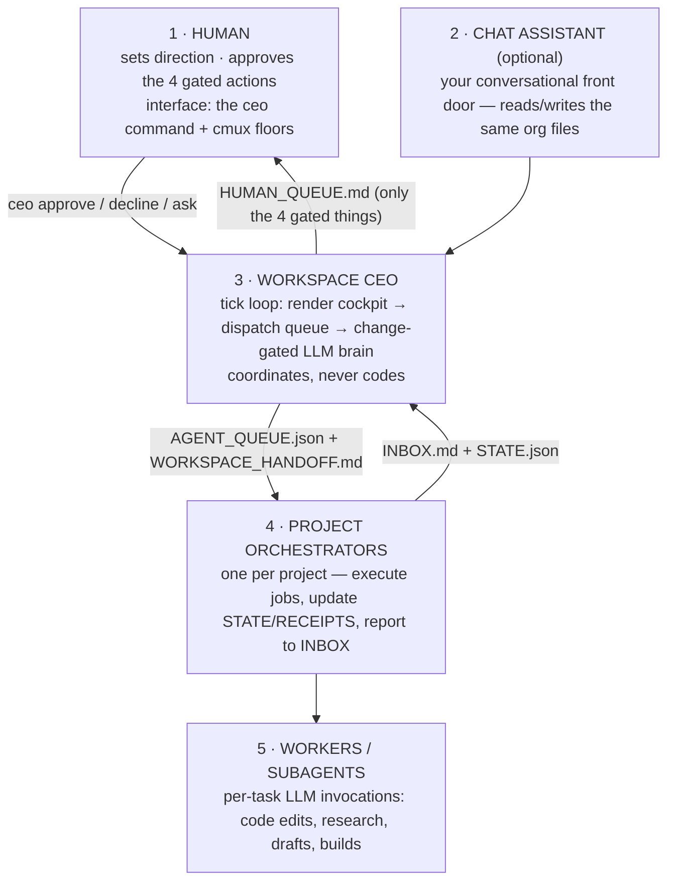

# workspace-ceo

[](https://github.com/claudiaclawdbot/workspace-ceo/actions/workflows/ci.yml)
[](LICENSE)


**A file-based AI organization that runs your projects while you sleep — with a human-approval gate on anything that leaves the machine.**

A Workspace CEO loop coordinates per-project agent "floors" inside [cmux](https://cmux.io) (each floor is an interactive [omp](https://omp.sh) session you can talk to), dispatches work to detached background jobs run by whichever agent CLI is available (Codex CLI → Claude Code → Gemini CLI → Ollama, with automatic fallback), and talks to you through a single `ceo` command. Everything the org knows, decides, and does lives in plain files you can read, grep, and audit.

```
you ──ceo approve──▶ APPROVALS.md ──▶ ┌─────────────────┐ ──▶ AGENT_QUEUE.json ──▶ detached agent jobs
                                      │  Workspace CEO   │                          (claude / codex / …)
you ◀── ceo status ◀── HUMAN_QUEUE ◀──│  tick loop       │ ◀── INBOX.md ◀────────── project receipts
                                      └─────────────────┘
```

## Why this exists

Running multiple AI-driven projects from chat sessions doesn't scale: context evaporates, agents step on each other, quotas burn silently, and you become the message bus. This kit replaces that with a small, inspectable org:

- **One driver loop** (`workspace-ceo-tick.sh`) — singleton-locked so duplicates can't silently burn quota.
- **An LLM "brain" that only runs when something changed** — idle ticks are free.
- **Detached background jobs** for real work — cmux is *display only* (a hard-won lesson; see [docs/LESSONS.md](docs/LESSONS.md)).
- **Four hard gates** — the org acts freely on local, reversible work and stops for exactly four things: external sends, spending money, production deploys, pushes to protected repos.
- **Receipts for everything** — every brain run and job writes an append-only audit trail.

## The cast (read this first — the names overlap confusingly)

Several of these names are both a product and a model family. In this README they always mean the **CLI tool on your PATH**:

| Name | What it actually is | Role in this kit |
|---|---|---|
| **workspace-ceo** (this repo) | a bash+node orchestration layer — no models of its own | schedules, routes, budgets, gates, and audits the work |
| [**`omp`**](https://omp.sh) (oh-my-pi) | an interactive coding-agent CLI (any model behind it) | the **floor agents** — the idle REPLs sitting in each cmux floor that you (or the CEO) can hand work to directly |
| **`codex`** (OpenAI Codex CLI), **`claude`** (Claude Code), **`gemini`** (Google Gemini CLI) | headless-capable coding-agent CLIs, each wrapping its vendor's models | the **job workers** — the dispatcher spawns one per queued job, trying them in waterfall order |
| **`ollama`** | a local model runtime (not an agent harness) | last-resort fallback when every cloud CLI is rate-limit benched |
| [**cmux**](https://cmux.io) | a terminal multiplexer with a GUI + control socket | **display only** — floors, status chips, live boards; never executes jobs |

Two naming notes: the registry file is `OMP_HARNESS.json` and the dispatcher is `omp-supervisor-once.sh` because "OMP" is this org's internal name, inherited from the omp-centric setup it grew out of — the files keep that name so the engine matches real deployments. And "the brain"/"the CEO" is not a separate program: it's one LLM invocation per tick (via the same waterfall, `claude` first) with the controller prompt and the org files as context.

## The five layers



## Communication is just files

| File | Direction | Purpose |
|---|---|---|
| `org/projects/<p>/WORKSPACE_HANDOFF.md` | CEO → project | current directive |
| `org/ceo/INBOX.md` | project → CEO | progress reports, escalations |
| `org/HUMAN_QUEUE.md` | CEO → you | the *only* things needing a decision |
| `org/ceo/APPROVALS.md` | you → CEO | your approve/decline/ask answers |
| `org/state.json` | shared | org truth (projects, statuses) |
| `org/AGENT_QUEUE.json` | CEO → dispatcher | the job queue |
| `org/ceo/runs/` | append-only | receipts (audit trail) |

No database, no message broker, no daemon you can't `cat`.

## Quickstart

```bash
git clone https://github.com/claudiaclawdbot/workspace-ceo.git ~/workspace
cd ~/workspace && ./install.sh        # creates runtime org files, checks deps, links the `ceo` command

# register your first project
scripts/bootstrap-project.sh my-app    # creates org/projects/my-app/ (prompt, STATE, receipts)
$EDITOR org/projects/my-app/PROJECT_CONTROLLER_PROMPT.md   # give it a real charter
$EDITOR org/OMP_HARNESS.json                               # add my-app to "projects" (copy example-app)

# start the org
bash scripts/workspace-ceo-tick.sh     # ideally inside a cmux pane so you can watch it

# talk to it (from any terminal)
ceo                       # status: what's running, what's waiting on you
ceo approve "my-app …"    # answer an approval ask
ceo log                   # watch the brain's receipts live
```

**Requirements:** macOS/Linux, `bash`, `node`, and at least one agent CLI on `PATH` — `claude` (Claude Code), `codex` (OpenAI Codex CLI), `gemini` (Google Gemini CLI), or `ollama` (local models). Optional but recommended: [cmux](https://cmux.io) for the visual floors, [`omp`](https://omp.sh) for the interactive floor agents.

## Isn't a coding-agent CLI already this?

No — and the distinction is the whole point. Claude Code, Codex CLI, Gemini CLI, and omp are **engines**: one brilliant session, one working directory, tools, even subagent fan-out *within that session*. This kit is the **plant around the engines**. It adds the layer the agent CLIs deliberately don't have:

| Need | A coding-agent CLI alone | workspace-ceo |
|---|---|---|
| Something happens while you're away | only while a session runs (and an always-on session burns tokens idling) | tick loop; **change-gated** brain — an idle org costs a few LLM calls a day |
| State that outlives a context window | session resume, until compaction eats it | plain files (`STATE.json`, receipts, handoffs) — greppable forever |
| Several projects at once | one cwd per session; you are the router | CEO routes via queue + per-project handoffs; parallel detached jobs |
| Provider hits its usage limit | session stops; you switch tools manually | waterfall auto-benches the provider and advances (codex → claude → gemini → ollama) |
| "Don't email anyone without asking" | a prompt instruction you hope holds, re-stated per session | standing gates + an approval queue (`ceo approve`) + audit receipts |
| A job hangs / duplicates / dies silently | you notice, eventually | PID-lifecycle jobs with timeouts, singleton locks, silent-exit retry, watchdog |

Put differently: the agent CLIs are excellent *employees*; this is the *org chart, the inbox, the approval chain, and the time clock*. The two compose — each dispatched job IS one of those CLIs, and interactive floor agents are plain `omp` sessions you can talk to directly.

## What it looks like

The `ceo` command, from any terminal:

```
═══ Workspace CEO ═══  Wed 23:30
● running (PID 35715)

Projects
  • my-app       — landing page shipped; tests green; drafting launch copy
  • my-contract  — all local work done, deploy gated on your approval

Waiting on you
  ⏳ my-app outreach send approval — 16 drafts staged, top 5 ranked
  ⏳ my-contract testnet deploy — needs faucet ETH + --broadcast approval

approve with:  ceo approve "<project> <what>"   (or: ceo decline "...")
```

And the driver pane ticking in cmux:

```
[dispatch] running queue tick…
  dispatched my-app-fix-pricing-20260611 (implementation-worker)  →  pid=75454
[ceo] invoking agent brain (content changed)…
[ceo] agent run complete.
Next tick in 900s  (Ctrl-C to stop)
```

## What runs where

| Piece | Script | Runs as |
|---|---|---|
| Driver loop (cockpit + dispatch + brain) | `workspace-ceo-tick.sh` | one foreground loop in a cmux pane |
| CEO brain (LLM decision pass) | `workspace-ceo-agent.sh` | invoked by the tick, change-gated |
| Job dispatcher | `omp-supervisor-once.sh` | invoked by the tick; spawns detached jobs |
| Project agent (one job) | `project-ceo-agent.sh <id>` | detached background process, PID + log in `org/jobs/` |
| Interactive floor agents | `cmux-floor.sh <id>` | idle `omp` REPL per floor — costs nothing until spoken to |
| Status roll-up + driver watchdog | `workspace-status-watch.sh` | tiny nohup daemon, no LLM |
| Wiki (per-project knowledge pages) | `wiki-watch.sh` | tiny nohup daemon, LLM only on change |
| Bring it all up/down | `workstation.sh up\|down\|status` | helper |

## Cost & reliability design

- **Change-gated brain** — the LLM only runs when watched inputs (INBOX, approvals, project STATE) actually changed (content hash, not mtime), or every Nth tick as a heartbeat. An idle org costs ~3 brain runs a day.
- **CLI waterfall with auto-benching** (`scripts/lib/ceo-waterfall.sh`) — jobs try `codex → claude → gemini → ollama` (the four CLIs from [the cast](#the-cast-read-this-first--the-names-overlap-confusingly), each using its own vendor's models); any CLI that hits a usage limit is benched (90 min–24 h) and the waterfall advances. An explicit override is *ignored* while that CLI is benched — a stale caller can't resurrect a rate-limited tool.
- **Singleton locks everywhere** — the driver, the watchers: duplicate loops are the #1 silent quota killer (ask us how we know).
- **Silent-exit retry** — if a job exits 0 but changed no files, it's retried once on claude. Catches agents that "succeed" without doing anything.
- **Kill switch** — `touch org/ceo/runs/STOP` pauses the whole org; `rm` it to resume. The watchdog paints a red chip + notification if the driver dies *without* a STOP file.

## The four gates (safety model)

The org does local, reversible work without asking. It must stop and queue a `HUMAN_QUEUE.md` item for:

1. **Sending anything external** — email, DM, form, public post.
2. **Spending money** — gas, wallets, paid APIs beyond your subscriptions.
3. **Production deploys.**
4. **Pushing to `main` or any human-owned repo.**

Keys stay out of the repo (`~/.config/omp.env`, chmod 600). The gate is *behavioral*, enforced by every prompt in the org — an agent with shell access can read anything you can, so never park real-money keys on an agent machine.

## Repo layout

```
scripts/            the whole engine (bash + a little node, no build step)
  lib/ceo-waterfall.sh   provider selection, benching, timeouts
org/
  OMP_HARNESS.json       registry: projects, job types, dispatch config
  ceo/                   CEO prompt, approvals, inbox, runs/ (receipts)
  projects/example-app/  what a registered project looks like
docs/
  ARCHITECTURE.md        the five layers + one tick, in detail
  LESSONS.md             v1 → v3: what broke and what fixed it
  ROADMAP.md             known weaknesses, honestly ranked
```

## License

MIT — see [LICENSE](LICENSE).
