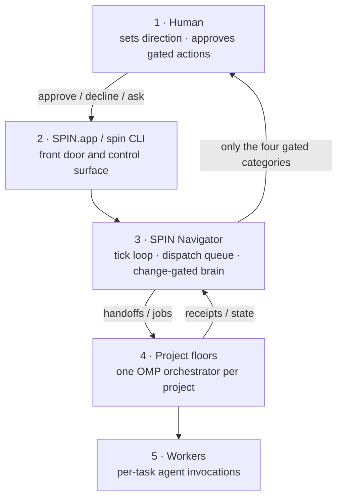

<div align="center">


# 🌀 SPIN

### Super Pi Interoperable Navigator

**A local app for running a small AI software org: SPIN keeps one Navigator above many isolated OMP project agents, refines your requests before delegation, and lets work fall through across configured model/provider lanes.**

[](https://github.com/claudiaclawdbot/spin/actions/workflows/ci.yml)
[](https://github.com/claudiaclawdbot/spin/actions/workflows/macos-app.yml)
[](https://claudiaclawdbot.github.io/spin/)
[](LICENSE)


**[Download SPIN.app beta for Mac](https://github.com/claudiaclawdbot/spin/releases/tag/v4.1.0-beta.1)** ·
**[Mac install guide](docs/MACOS_TESTER_INSTALL.md)** ·
**[Public beta readiness](docs/PUBLIC_BETA_READINESS.md)** ·
**[Website](https://claudiaclawdbot.github.io/spin/)**

</div>

---

## The Short Version

SPIN is for builders who are past the point where one terminal agent and one
repo context are enough. It gives you one local control surface for a small AI
software org:

- **One Navigator:** the top-level agent you talk to, like a project lead.
- **Many project floors:** one isolated OMP-backed workspace per project.
- **Better delegation:** SPIN rewrites raw human asks into project-ready prompts
  with goals, paths, constraints, checks, and reporting instructions.
- **Model fallback:** OMP handles provider roles, order, retries, and fallback
  across the accounts you have configured.
- **Plain-file receipts:** queues, approvals, handoffs, inboxes, and project
  state stay inspectable on disk.

SPIN.app is the main product. It is a self-contained Mac app that bundles a SPIN-branded [cmux](https://github.com/manaflow-ai/cmux) workspace UI and [oh-my-pi](https://omp.sh) (`omp`) as the agent/provider engine. SPIN adds the lightweight harness around those tools: a Coordinator floor, one project floor per workspace, approval queues, background jobs, receipts, model fallback policy, and plain-file state you can inspect.

SPIN is built for the moment one terminal agent stops being enough. A single OMP session works well for one repository, one working directory, one objective, and one focused context. Multiple projects change the job. The human starts managing terminal tabs, remembering which agent owns which work, checking receipts, relaying updates, tracking blockers, and deciding what needs attention next.

SPIN is the orchestration layer above those scoped agents. Each project keeps its own OMP agent, repository, queue, memory, and receipts. The SPIN Navigator maintains the organization-level map, routes work between projects, tracks state, and surfaces only the decisions that need a human.

SPIN does not merge contexts. It orchestrates them.

In this repo, **interoperable** means two related things:

- **Project interoperability:** isolated OMP agents cooperate through SPIN's files, queues, receipts, and Navigator decisions without sharing every working token.
- **Model/provider interoperability:** because those agents run through OMP first, SPIN can use OMP roles, provider order, and fallback chains across authenticated services. If a model, quota window, or provider lane is unavailable, work can fall through to another configured lane instead of locking the whole org to one CLI, one model, or one subscription window.

When you ask the Coordinator to send work into a project floor, SPIN also rewrites the raw human request into a project-facing directive before it is typed into that project's OMP agent. The refined directive keeps your intent, then adds the concrete goal, local paths, constraints, acceptance checks, things not to touch, and the expected reporting shape.

The source/CLI install still exists, but it is the power-user lane for Linux, automation, debugging, app development, and recovery. It is documented separately below.

## Who It Is For

SPIN is useful if you are trying to ship across more than one active codebase
and you want AI agents to help without making you manually route every task.
It is especially suited to solo devs and tiny teams who want a local-first
workflow, visible project floors, file-backed state, and a clear approval gate.

SPIN is not a cloud agent platform, a generic adapter for every harness, or a
replacement for understanding what your agents are doing. It is a lightweight,
inspectable layer above OMP-backed project agents.

## Public Beta Status

The Mac app is coherent enough to show: it packages the branded cmux workspace,
bundled OMP/Pi runtime, Navigator sidebar, onboarding route, app health checks,
manual update path, and repeatable release checks.

The honest beta boundaries are:

- the current public build is Apple Silicon only;
- the DMG is ad-hoc signed and not notarized yet;
- you still bring your own provider accounts, GitHub auth, repositories, and
  normal developer tools;
- live provider execution depends on your OMP setup, so public demos should
  show both the app flow and the health check;
- broad distribution would benefit from a notarized Developer ID build, a short
  product demo video, and a small public feedback loop.

See [`docs/PUBLIC_BETA_READINESS.md`](docs/PUBLIC_BETA_READINESS.md) for the
presentation checklist, demo script, and what to say clearly before a wider
public launch.

## Download SPIN.app for Mac

The current public Mac build is the open-source beta DMG:

1. Download the beta from [v4.1.0-beta.1](https://github.com/claudiaclawdbot/spin/releases/tag/v4.1.0-beta.1).
2. Open the DMG and drag `SPIN.app` into Applications.
3. Open SPIN and complete onboarding.

The beta is ad-hoc signed and not notarized, so macOS may show a Gatekeeper warning on first launch. That is expected for this tester lane. Use Finder right-click / Control-click Open if needed. The install guide also includes optional checksum verification for testers who want extra assurance before opening the DMG.

SPIN.app includes:

| Included in the app | Purpose |
|---|---|
| SPIN-branded cmux UI app | Native workspace window, tabs, terminals, live boards, and socket control |
| Bundled `cmux` CLI | Internal control path for creating and driving project floors |
| Bundled `omp` / `spin-agent` | Agent runtime and model/provider gateway |
| SPIN runtime scripts | Project orchestration, approvals, queues, receipts, health checks, updates |
| App icon, dock controls, notices | Product shell, app health, OMP setup, update surface, third-party notices |

You still bring your own provider accounts, GitHub auth, repositories, and normal developer tools.

## What The App Does

Launch `SPIN.app` and it opens the workspace interface:

- **Coordinator floor:** a high-level OMP agent you talk to like a project lead.
- **One tab per project:** each project gets its own cmux workspace, live OMP orchestrator, queue, state, and receipts.
- **Context isolation:** project agents stay focused on their own repositories instead of sharing one giant working context.
- **Refined delegation:** the Navigator turns your request into a concrete project prompt before it hands work to a project floor.
- **Background driver:** the Navigator loop routes work, watches project state, and dispatches durable jobs.
- **Plain-file org state:** approvals, queues, project status, receipts, and handoffs live in files under the SPIN runtime.

The stack is intentionally small:

| Layer | Role |
|---|---|
| **SPIN.app** | Mac product shell, launcher, bundled runtime, health/update controls |
| **cmux** | The GUI workspace: tabs, terminals, boards, socket control |
| **OMP/Pi** | Agent sessions, provider auth, model selection, retry/fallback |
| **SPIN runtime** | Lightweight harness: project registry, org files, gates, queues, receipts |

## Model And Provider Fallback

OMP owns model/provider setup. During onboarding, SPIN hands account configuration to OMP rather than asking for keys itself.

SPIN writes a runtime OMP config overlay for coordinator and project work:

- `modelRoles` for default, small, slow, plan, and task work
- `modelProviderOrder` across authenticated providers
- `retry.fallbackChains` so usage, rate, quota, server, and network failures can fall through coherently

The intended waterfall is OMP first. Inside OMP, fallback can move between authenticated model/provider lanes such as Anthropic, OpenAI Codex, OpenRouter, Gemini, or local runtimes, depending on what you configured. If OMP itself is missing or hard-fails, SPIN still has an outer direct-CLI fallback lane through tools such as `codex`, `claude`, `gemini`, and `ollama`.

## Safety Model

SPIN does local, reversible work without asking. It stops and queues a human decision for exactly four categories:

1. **External sends:** email, DM, forms, public posts.
2. **Spending money:** wallets, paid APIs beyond subscriptions, purchases.
3. **Production deploys:** anything that ships to users.
4. **Protected pushes:** `main` or any human-owned repo.

The gate is behavioral and prompt-enforced. Do not park real-money keys on an agent machine.

## App Updates

The app has a checked update path for downloaded future artifacts:

```bash
spin app-updates --check --candidate ~/Downloads/SPIN-<version>-macos-arm64.dmg
spin app-updates --install --yes --allow-test-builds \
  --candidate ~/Downloads/SPIN-<version>-macos-arm64.dmg
```

That path verifies the candidate compatibility manifest, preserves local app state, backs up the replaced app, and writes rollback metadata before replacing app-owned code.

The current updater does not yet fetch a remote update feed or auto-install from GitHub in the background. Download the new DMG first, then run the app update check/install command.

## App Docs

- [`docs/MACOS_TESTER_INSTALL.md`](docs/MACOS_TESTER_INSTALL.md): download, install, first launch, health checks, updates, uninstall.
- [`docs/PUBLIC_BETA_READINESS.md`](docs/PUBLIC_BETA_READINESS.md): positioning, demo script, beta boundaries, public checklist, feedback loop.
- [`docs/APP_BUNDLE.md`](docs/APP_BUNDLE.md): bundle layout, release checks, update manifests, signing, packaging.
- [`docs/OPEN_SOURCE_TESTER_RELEASE.md`](docs/OPEN_SOURCE_TESTER_RELEASE.md): maintainer checklist for publishing the GitHub DMG.
- [`SECURITY.md`](SECURITY.md): local automation boundary, vulnerability reporting, provider-key posture.

---

## Source / CLI Setup

Use this lane for Linux, headless operation, automation, debugging, app development, or recovery. The source install is not required for normal Mac app testing.

Requirements for the source lane:

- macOS or Linux
- `bash`
- `node`
- `omp` or at least one direct fallback CLI on `PATH`: `claude`, `codex`, `gemini`, or `ollama`
- `cmux` if you want the visual workspace outside the packaged app

Install from source:

```bash
git clone https://github.com/claudiaclawdbot/spin.git ~/spin
cd ~/spin && ./install.sh

spin init
spin
```

One-liner, if you prefer that flow:

```bash
curl -fsSL https://raw.githubusercontent.com/claudiaclawdbot/spin/main/spin-bootstrap.sh | bash
```

`spin-bootstrap.sh` is a tiny launcher that clones SPIN and runs the installer. For a single offline file, download [`spin-offline.sh`](https://github.com/claudiaclawdbot/spin/raw/main/spin-offline.sh) and run:

```bash
bash spin-offline.sh
```

### Source Updates

For a source checkout, update from inside the checkout:

```bash
spin update
```

The source updater checks for local edits, refuses to update while project jobs are running, backs up `org/` and `logs/` to `.spin/backups/`, pauses the driver if needed, fast-forwards the repo, reruns `install.sh`, applies migrations, runs `spin doctor`, then restarts the driver if it was running before.

Useful checks:

```bash
spin update --check
spin update --dry-run
spin version
```

See [`docs/UPGRADING.md`](docs/UPGRADING.md) for rollback notes.

### CLI Commands

`spin` is the human control surface:

```text
spin                 status: projects, what's waiting on you, recent activity
spin watch           live dashboard, refreshing
spin web             local browser panel for approvals, jobs, floors, receipts
spin approve "<x>"   answer an approval
spin decline "<x>"   decline or hold an approval
spin ask "<q>"       ask the Navigator an async question
spin delegate --wait <project> "<task>"
spin start | stop    run or pause the Navigator loop
spin up | down       launch or tear down cmux floors and daemons
spin doctor          health check
```

`org` is the state-change CLI agents use:

```text
org queue-job <project> <type> "<desc>" [--max-runtime SEC]
org set-handoff <project>
org set-state <project> --status S --next "..."
org escalate "<item>"
org process-approval <sel> <approve|decline|ask> --note "..."
org receipt
org inbox <project> "<msg>"
org show
```

Every `org` verb validates input, takes a lock, writes atomically, and keeps history append-only where history matters.

---

## Under The Hood

This section applies to both SPIN.app and the source/CLI lane.

### What The Name Means

- **Super:** a higher-level harness you can track, audit, and interrupt.
- **Pi:** the agentic backbone. Specifically **[oh-my-pi](https://omp.sh) (`omp`)**: every floor agent and interactive session runs on it.
- **Interoperable:** isolated project agents cooperate through SPIN's org files, while OMP gives those agents model/provider portability and fallback across the services you have configured.
- **Navigator:** the system that coordinates projects, queues, approvals, and receipts.

### Why SPIN Exists

Coding agents are strongest when their scope is narrow: one project, one directory, one goal, one relevant memory. The problem is not that one OMP agent cannot code. The problem is that a real software organization quickly becomes many projects, many agents, many receipts, and many queues.

Without SPIN, the human becomes the operating system. You remember which terminal owns which project, which project is waiting on another, which agent hit a blocker, and which context belongs where.

SPIN replaces that human routing overhead with a small, inspectable org:

- **One Navigator loop:** a lock file prevents duplicate drivers from silently doubling LLM spend.
- **Change-gated brain:** the LLM runs only when watched inputs actually changed, plus a low-frequency heartbeat.
- **Detached background jobs:** durable work does not depend on a visible cmux pane.
- **Prompt refinement:** live project-floor handoffs are rewritten into concrete project directives before they are sent.
- **State changed through a CLI:** agents call validated `org` verbs instead of hand-editing JSON.
- **Context isolation:** each project agent works from its own repository, handoff, state, and receipts.
- **Receipts for everything:** brain runs and jobs write append-only audit trails.

### Communication Is Just Files

| File | Direction | Purpose |
|---|---|---|
| `org/projects/<p>/WORKSPACE_HANDOFF.md` | Navigator -> project | Current directive |
| `org/ceo/INBOX.md` | Project -> Navigator | Progress reports and escalations |
| `org/HUMAN_QUEUE.md` | Navigator -> human | Items that need a decision |
| `org/ceo/APPROVALS.md` | Human -> Navigator | Approve / decline / ask answers |
| `org/state.json` | Shared | Org truth: projects and statuses |
| `org/AGENT_QUEUE.json` | Navigator -> dispatcher | Job queue |
| `org/ceo/runs/` | Append-only | Run receipts and logs |

No database, no message broker, no daemon you cannot inspect.

### The Cast

| Name | What it is | Role |
|---|---|---|
| **SPIN** | Bash + Node orchestration layer | Schedules, routes, gates, audits |
| **SPIN.app** | Mac app bundle | Packages cmux, OMP, and the SPIN runtime |
| [`omp`](https://omp.sh) | Agent harness and model gateway | Runs floors/jobs and handles model/provider fallback |
| `codex` / `claude` / `gemini` | Direct vendor CLIs | Outer fallback if OMP is missing or hard-fails |
| `ollama` | Local model runtime | Last-resort local fallback |
| [cmux](https://github.com/manaflow-ai/cmux) | Terminal workspace with GUI and socket control | Visual floors, tabs, boards, delegate handoffs |

### The Five Layers



### Cost And Reliability

- **OMP-first fallback:** SPIN writes a runtime OMP config overlay with `modelRoles` and `retry.fallbackChains`.
- **Provider benching:** rate/usage/session-limit failures temporarily bench that provider so work can fall through.
- **Refined handoffs:** live delegations carry a rewritten directive with goal, paths, constraints, checks, and reporting instructions.
- **Duplicate-loop prevention:** driver, watchers, and dispatcher claim locks and exit if already running.
- **Job timeouts:** hung jobs are killed after `max_runtime_seconds`.
- **Kill switch:** `spin stop` or `org/ceo/runs/STOP` pauses the org.

### Repo Layout

```text
app/                  Mac app shell, cmux config/sidebar assets, bundle templates
agent/                OMP/Pi-derived agent runtime home
assets/branding/      SPIN icon and app branding
docs/                 app install, app bundle, architecture, roadmap, release docs
install.sh            source checkout setup
scripts/              SPIN runtime, app health, update, release, org CLI
  spin                human command
  org                 validated state-change command
  lib/                runtime helpers and provider fallback
org/                  seed org files for source installs and app runtime
runtime/              runtime migration notes
```

## Acknowledgments

SPIN stands on open tools:

- **[oh-my-pi / omp](https://omp.sh):** the agent CLI and model gateway at the center of SPIN.
- **[cmux](https://github.com/manaflow-ai/cmux):** the agent-oriented terminal workspace, built on **[Ghostty](https://ghostty.org)**.
- **[Claude Code](https://claude.com/claude-code)**, **[OpenAI Codex CLI](https://github.com/openai/codex)**, **[Gemini CLI](https://github.com/google-gemini/gemini-cli)**, and **[Ollama](https://ollama.com)**: direct agent/runtime fallback lanes.
- **[OpenRouter](https://openrouter.ai)** and the other backends reachable through OMP.

## License

MIT: see [LICENSE](LICENSE). SPIN's MIT license covers this repo only; bundled or upstream tools keep their own licenses and notices.
