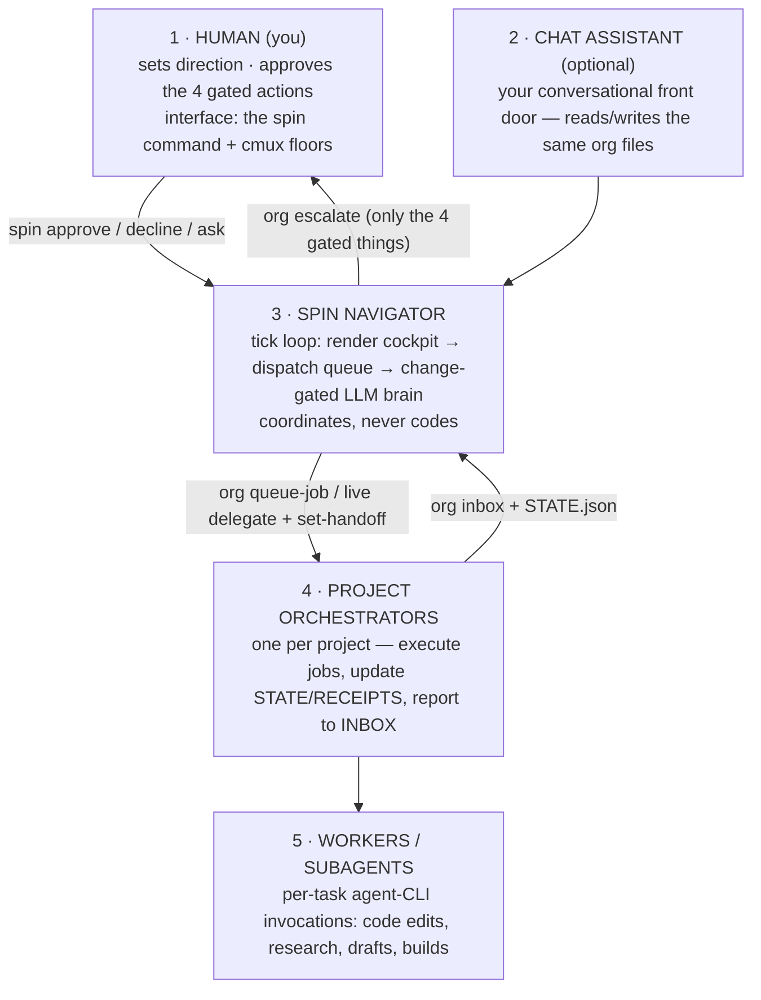

<div align="center">

# 🌀 SPIN

### Super Pi Interoperable Navigator

**A file-based AI organization that runs your projects while you sleep — gated on the four things that actually matter.**

[](https://github.com/claudiaclawdbot/spin/actions/workflows/ci.yml)
[](https://github.com/claudiaclawdbot/spin/actions/workflows/macos-app.yml)
[](https://claudiaclawdbot.github.io/spin/)
[](LICENSE)


</div>

---

SPIN is the **plant around your coding agents.** A single Navigator loop coordinates per-project agent "floors" inside [cmux](https://github.com/manaflow-ai/cmux), dispatches work to detached background jobs through [oh-my-pi](https://omp.sh) (`omp`) first, and talks to you through one command: `spin`. OMP handles the normal model/provider fallback across your authenticated Anthropic, OpenAI, OpenRouter, Cursor, local, or other accounts; direct CLIs remain an outer safety net. Everything the org knows, decides, and does lives in plain files you can read, grep, and audit.

```
you ──spin approve──▶ APPROVALS.md ──▶ ┌──────────────────┐ ──▶ AGENT_QUEUE.json ──▶ detached agent jobs
                                       │   SPIN Navigator  │                          (run by an agent CLI)
you ◀── spin status ◀── HUMAN_QUEUE ◀──│   tick loop       │ ◀── INBOX.md ◀────────── project receipts
                                       └──────────────────┘
```

## What the name means

- **Super** — combines a bunch of cutting-edge dev tools into one harness that works *with* you: you can track it, and it reports back to you.
- **Pi** — the agentic backbone. Specifically **[oh-my-pi](https://omp.sh) (`omp`)**: every floor agent and interactive session runs on it. The engine SPIN is built around — and the letters at the heart of the name.
- **Interoperable** — swap LLMs on the fly, plug-and-play. Because all state and memory live in **plain files**, any agent CLI (Claude, Codex, Gemini, Ollama) picks up the same context. No lock-in.
- **Navigator** — the whole system, steering. Maximally legible for **humans** (live floors, status boards) and ordered for **agents** (clean files, validated verbs).

## Install in 30 seconds

```bash
git clone https://github.com/claudiaclawdbot/spin.git ~/spin
cd ~/spin && ./install.sh    # installs missing deps, seeds runtime files, links `spin` + `org`

spin init                    # onboarding wizard: providers (+ OpenRouter), your first
                             # project, a supervisor that keeps it alive — then starts it
spin                         # check on it any time
```

`spin init` is the fast path. Prefer to wire it by hand? `spin doctor` → `scripts/bootstrap-project.sh my-app` → edit its charter → `spin service install` (keeps the driver alive across crashes/reboots) → `spin`.

One-liner (review the script first, like any `curl | bash`):

```bash
curl -fsSL https://raw.githubusercontent.com/claudiaclawdbot/spin/main/spin-bootstrap.sh | bash
```

`spin-bootstrap.sh` is a tiny launcher that clones SPIN and runs the installer. Want a **single file that works fully offline** (no git, no network — everything embedded)? Download [`spin-offline.sh`](https://github.com/claudiaclawdbot/spin/raw/main/spin-offline.sh) and run `bash spin-offline.sh`.

## Self-contained app track

SPIN is also gaining a macOS app-bundle path where **SPIN is the product** and
cmux/OMP are internal foundations instead of separate user-installed tools. The
repo now has the release shape for that work: `app/` for the SPIN-branded cmux
shell, `agent/` for the OMP/Pi-derived runtime, `runtime/` for migration notes,
and packaging checks in `scripts/package-macos-app.sh` plus
`scripts/check-app-release.sh`. The source-built cmux fork proof is
`scripts/build-app-proof.sh --source-cmux`. See
[`docs/APP_BUNDLE.md`](docs/APP_BUNDLE.md) and
[`docs/APP_ROADMAP.md`](docs/APP_ROADMAP.md).

There are now two lanes:

- **CLI/runtime lane:** the stable path today. Clone the repo, run
  `./install.sh`, then `spin init`.
- **macOS app tester lane:** checked `SPIN.app` artifacts that bundle cmux and
  OMP/Pi. These are for early testers until Developer ID notarization is wired.

Early macOS app builds can be released as open-source beta artifacts without
Apple Developer ID:

```bash
SPIN_RELEASE_FORMAT=dmg scripts/release-macos.sh --source-cmux
scripts/prepare-open-source-release.sh --artifact dist/release/SPIN-*-macos-*.dmg
```

These builds are ad-hoc signed and not notarized, so macOS may show Gatekeeper
warnings. Download the current beta from
[v4.1.0-beta.1](https://github.com/claudiaclawdbot/spin/releases/tag/v4.1.0-beta.1),
then follow [`docs/MACOS_TESTER_INSTALL.md`](docs/MACOS_TESTER_INSTALL.md).
Maintainer release notes live in
[`docs/OPEN_SOURCE_TESTER_RELEASE.md`](docs/OPEN_SOURCE_TESTER_RELEASE.md).

## Updating SPIN

Once installed, update from inside your SPIN checkout:

```bash
spin update
```

The updater is designed for consumer installs: it checks for local edits, refuses
to update while project jobs are running, backs up `org/` and `logs/` to
`.spin/backups/`, pauses the driver if needed, fast-forwards the repo, reruns
`install.sh`, applies any runtime migrations, runs `spin doctor`, then restarts
the driver if it was running before.

Useful checks:

```bash
spin update --check     # see whether an update is available
spin update --dry-run   # preview the steps without changing files
spin version            # show VERSION + git checkout + installed marker
```

See [docs/UPGRADING.md](docs/UPGRADING.md) for rollback and maintainer notes.

**Requirements:**

- **Required** — macOS/Linux, `bash`, `node`, and `omp` or at least one direct fallback CLI on `PATH`: `claude` (Claude Code), `codex` (OpenAI Codex CLI), `gemini` (Google Gemini CLI), or `ollama` (local models).
- **[`omp`](https://omp.sh) (oh-my-pi) — the agent backbone.** SPIN is built around it: every floor agent (the Navigator you chat with, each project's live REPL, the delegate-and-watch path) is an omp session, and queued jobs try OMP first with a SPIN-generated config overlay for `modelRoles` and `retry.fallbackChains`. It's where the name comes from — oh-my-**pi** → `OMP_HARNESS.json` → the **Pi** in SPIN.
- **[cmux](https://github.com/manaflow-ai/cmux) — the display.** The visual workspace that shows the floors, status chips, and live boards. Genuinely optional: omp floors work without it, just less visibly.

## The interface — cmux *is* your GUI

SPIN isn't a CLI you babysit; it's an app whose window is [cmux](https://github.com/manaflow-ai/cmux). Run `spin up` and you get:

- a **Coordinator floor** — an [omp](https://omp.sh) agent you *talk to* like a person ("build me a landing page for X"),
- one **workspace tab per project** in the cmux sidebar — your browser-style tabs, each a live omp orchestrator for that project,
- the **driver** coordinating in the background, relaying work between projects through the org files.

Tell the Coordinator what you want and it spins up the project:

```
you (in the Coordinator floor):  "start a project for my fidget-spinner shop"
  → spin new-project fidget-shop "an online fidget-spinner store"
  → a new "fidget-shop" tab appears in your sidebar, with its own agent, already briefed
```

When you want that visible project coordinator to do something now, the Coordinator
uses `spin delegate --wait <project> "<task>"`. That sends the task into the
project's live cmux/omp floor, stamps it with a request id, and waits for the
project to report back through the org inbox.

So the stack reads cleanly: **cmux** is the screen, **omp** is the engine in each tab, and **SPIN** is the brain wiring them into one coordinated org. No Electron, no separate app to maintain — the terminal workspace *is* the product.

## Why SPIN exists

Running multiple AI-driven projects from chat sessions doesn't scale: context evaporates, agents step on each other, quotas burn silently, and you become the message bus. SPIN replaces that with a small, inspectable org:

- **One Navigator loop** — it claims a lock file at startup, so a second accidental launch just prints "already running" and exits instead of silently doubling your LLM spend.
- **A brain that only thinks when something changed** — the LLM runs only when watched inputs move (content hash, not mtime). An idle org costs a couple of LLM calls a day.
- **Detached background jobs** for durable background work. Explicit `spin delegate`
  handoffs are the live, human-visible path into a project floor; queued jobs do not
  depend on cmux panes.
- **State changed through a CLI, never hand-edited** — agents call `org queue-job …`, `org set-state …`; the verbs validate, lock, and append so a mistyped bracket can't corrupt the queue.
- **Four hard gates** — SPIN acts freely on local, reversible work and stops for exactly four things: external sends, spending money, production deploys, pushes to protected repos.
- **Receipts for everything** — every brain run and job writes an append-only audit trail.

## The cast (read this first — the names overlap confusingly)

Several of these are both a product and a model family. Here they always mean the **CLI tool on your PATH**:

| Name | What it actually is | Role in SPIN |
|---|---|---|
| **SPIN** (this repo) | a bash+node orchestration layer — no models of its own | schedules, routes, budgets, gates, and audits the work |
| [**`omp`**](https://omp.sh) (oh-my-pi) | the agent harness and model gateway | runs the Coordinator/project agents and handles normal fallback across authenticated model providers |
| **`codex`** · **`claude`** · **`gemini`** | direct vendor CLIs | outer fallback if OMP is missing or hard-fails |
| **`ollama`** | a local model runtime | last-resort outer fallback |
| [**cmux**](https://github.com/manaflow-ai/cmux) | a terminal multiplexer with a GUI + control socket | visual floors, status chips, live boards, and explicit `spin delegate` handoffs |

The Navigator's "brain" is not a separate program: it's one OMP agent invocation per tick with the controller prompt and the org files as context. The registry file is named `OMP_HARNESS.json` for continuity with the omp-centric setup SPIN grew out of.

## The five layers



## Communication is just files

| File | Direction | Purpose |
|---|---|---|
| `org/projects/<p>/WORKSPACE_HANDOFF.md` | Navigator → project | current directive |
| `org/ceo/INBOX.md` | project → Navigator | progress reports, escalations |
| `org/HUMAN_QUEUE.md` | Navigator → you | the *only* things needing a decision |
| `org/ceo/APPROVALS.md` | you → Navigator | your approve/decline/ask answers |
| `org/state.json` | shared | org truth (projects, statuses) |
| `org/AGENT_QUEUE.json` | Navigator → dispatcher | the job queue |
| `org/ceo/runs/` | append-only | receipts (audit trail) |

No database, no message broker, no daemon you can't `cat`.

## The two commands

**`spin`** — your control surface:

```
spin                 status: projects, what's waiting on you, recent activity
spin watch           live dashboard, refreshing
spin web             local browser panel for approvals, jobs, floors, receipts
spin approve "<x>"   answer an approval   ·   spin decline / spin ask
spin delegate --wait <project> "<task>"    send work to a live project floor
spin start | stop    run / pause the Navigator loop
spin up | down       launch / tear down all cmux floors + daemons
spin doctor          health check: deps, driver, floors, watchers
```

**`org`** — how agents change state safely (you rarely type this; the Navigator does):

```
org queue-job <project> <type> "<desc>" [--max-runtime SEC]
org set-handoff <project>        org set-state <project> --status S --next "…"
org escalate "<item>"            org process-approval <sel> <approve|decline|ask> --note "…"
org receipt                      org inbox <project> "<msg>"        org show
```

Every `org` verb validates its input (unknown project? disallowed job type? → rejected), takes a lock, writes atomically, and never deletes history.

## Cost & reliability design

- **Change-gated brain** — the LLM runs only when real inputs (approvals, inbox, project state) changed, plus a low-frequency heartbeat.
- **OMP-first fallback** (`scripts/lib/ceo-waterfall.sh`) — SPIN writes a runtime OMP config overlay (`org/ceo/runs/spin-omp-config.yml`) with `modelRoles` and `retry.fallbackChains`. OMP retries rate/usage/server/network failures, switches authenticated credentials when available, and falls through configured models such as Anthropic → OpenAI Codex → OpenRouter. If OMP itself is absent or hard-fails, SPIN falls back to direct CLI lanes: `codex → claude → gemini → ollama`.
- **Nothing runs twice** — the driver, the watchers, and the dispatcher each claim a lock file and exit if a live copy already holds it. Duplicate loops are the #1 silent quota killer.
- **Job timeouts** — a hung job is killed (whole process group) after `max_runtime_seconds` (default 1 h) so it can't hold its project lane forever.
- **Silent-exit retry** — a job that exits 0 having changed no files is retried once on claude.
- **Driver watchdog** — a red chip + desktop notification when the loop dies without a STOP file.
- **Kill switch** — `spin stop` (or `touch org/ceo/runs/STOP`) pauses the whole org; `spin start` resumes.

## The four gates (safety model)

SPIN does local, reversible work without asking. It stops and queues a `HUMAN_QUEUE.md` item for:

1. **Sending anything external** — email, DM, form, public post.
2. **Spending money** — gas, wallets, paid APIs beyond your subscriptions.
3. **Production deploys.**
4. **Pushing to `main` or any human-owned repo.**

Keys stay out of the repo (`~/.config/omp.env`, chmod 600). The gate is *behavioral*, enforced by every prompt in the org — an agent with shell access can read anything you can, so never park real-money keys on an agent machine.

## Repo layout

```
spin-bootstrap.sh    tiny launcher for the curl|bash one-liner (clones + installs)
spin-offline.sh      fully-offline single file (embeds everything; generated)
install.sh           setup for a git clone
scripts/             the engine (bash + node, no build step)
  spin                 your command (status, approve, init, service, …)
  org                  the state CLI agents call
  spin-init.sh         onboarding wizard (spin init)
  spin-service.sh      supervisor installer — launchd (macOS) / systemd (Linux)
  lib/ceo-waterfall.sh provider selection, benching, timeouts
org/
  OMP_HARNESS.json     registry: projects, job types, dispatch config
  ceo/                 Navigator prompt, approvals, inbox, runs/ (receipts)
  projects/example-app/ what a registered project looks like
docs/
  ARCHITECTURE.md      the five layers + one tick, in detail
  LESSONS.md           v1 → v4: what broke and what fixed it
  ROADMAP.md           known weaknesses, honestly ranked
```

## Acknowledgments

SPIN is glue. It's worthless without the open tools it stands on — full credit and thanks to the people who built them:

- **[oh-my-pi / omp](https://omp.sh)** — the agent CLI that is SPIN's interactive backbone (the *Pi*) and its gateway to ~15 model backends.
- **[cmux](https://github.com/manaflow-ai/cmux)** — the agent-oriented terminal workspace that gives SPIN its visual floors, built on **[Ghostty](https://ghostty.org)** by Mitchell Hashimoto.
- The agent CLIs SPIN dispatches to: **[Claude Code](https://claude.com/claude-code)** (Anthropic), **[OpenAI Codex CLI](https://github.com/openai/codex)**, **[Gemini CLI](https://github.com/google-gemini/gemini-cli)** (Google), and **[Ollama](https://ollama.com)** for local models.
- **[OpenRouter](https://openrouter.ai)** and the other backends reachable through omp.

If you maintain one of these and want the credit adjusted or a link fixed, open an issue — happy to get it right.

## License

MIT — see [LICENSE](LICENSE). Built in the open; issues and PRs welcome (see [CONTRIBUTING](CONTRIBUTING.md)). SPIN's MIT license covers this repo only; each upstream tool keeps its own license.
