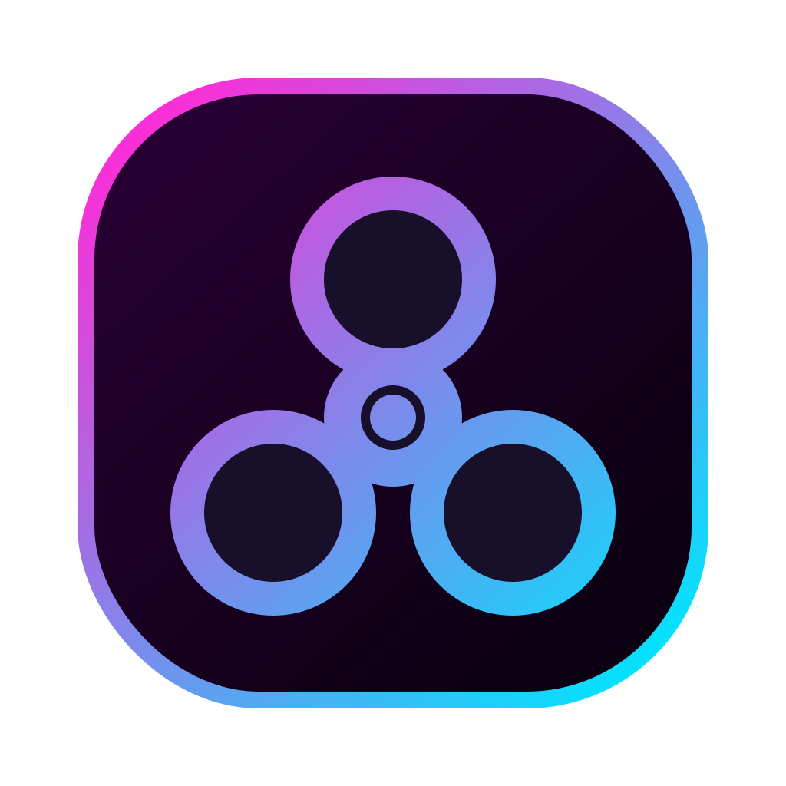
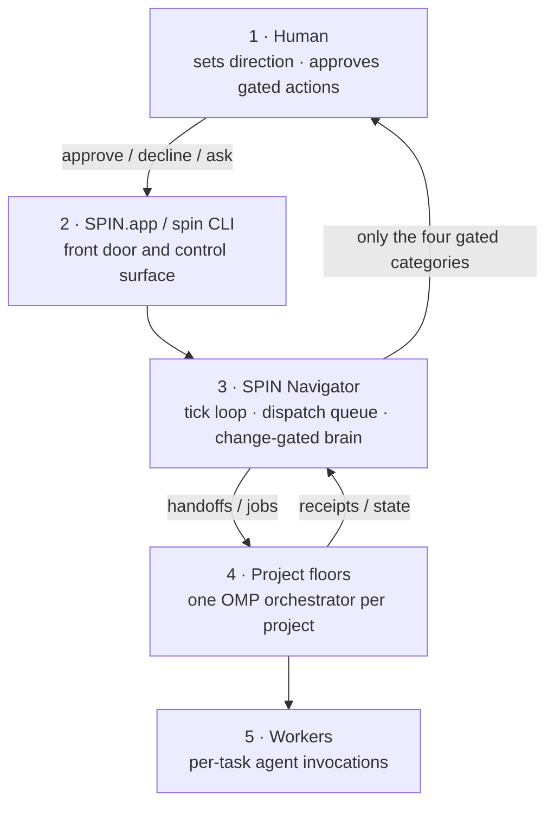

<div align="center">



# 🌀 SPIN

### Super Pi Interoperable Navigator

**A Mac app for running a small AI org across your projects: custom cmux UI, bundled OMP, project floors, approvals, receipts, and provider fallback.**

[](https://github.com/claudiaclawdbot/spin/actions/workflows/ci.yml)
[](https://github.com/claudiaclawdbot/spin/actions/workflows/macos-app.yml)
[](https://claudiaclawdbot.github.io/spin/)
[](LICENSE)


**[Download SPIN.app beta for Mac](https://github.com/claudiaclawdbot/spin/releases/tag/v4.1.0-beta.1)** ·
**[Mac install guide](docs/MACOS_TESTER_INSTALL.md)** ·
**[Website](https://claudiaclawdbot.github.io/spin/)**

</div>

---

SPIN.app is the main product. It is a self-contained Mac app that bundles a SPIN-branded [cmux](https://github.com/manaflow-ai/cmux) workspace UI and [oh-my-pi](https://omp.sh) (`omp`) as the agent/provider engine. SPIN adds the project system around those tools: a Coordinator floor, one project floor per workspace, approval queues, background jobs, receipts, and plain-file state you can inspect.

The source/CLI install still exists, but it is the power-user lane for Linux, automation, debugging, app development, and recovery. It is documented separately below.

## Download SPIN.app for Mac

The current public Mac build is the open-source beta DMG:

1. Download the beta from [v4.1.0-beta.1](https://github.com/claudiaclawdbot/spin/releases/tag/v4.1.0-beta.1).
2. Open the DMG and drag `SPIN.app` into Applications.
3. Open SPIN and complete onboarding.

The beta is ad-hoc signed and not notarized, so macOS may show a Gatekeeper warning on first launch. That is expected for this tester lane. Use Finder right-click / Control-click Open if needed. The install guide also includes optional checksum verification for testers who want extra assurance before opening the DMG.

SPIN.app includes:

| Included in the app | Purpose |
|---|---|
| SPIN-branded cmux UI app | Native workspace window, tabs, terminals, live boards, and socket control |
| Bundled `cmux` CLI | Internal control path for creating and driving project floors |
| Bundled `omp` / `spin-agent` | Agent runtime and model/provider gateway |
| SPIN runtime scripts | Project orchestration, approvals, queues, receipts, health checks, updates |
| App icon, dock controls, notices | Product shell, app health, OMP setup, update surface, third-party notices |

You still bring your own provider accounts, GitHub auth, repositories, and normal developer tools.

## What The App Does

Launch `SPIN.app` and it opens the workspace interface:

- **Coordinator floor:** an OMP agent you talk to like a project lead.
- **One tab per project:** each project gets its own cmux workspace and live OMP orchestrator.
- **Background driver:** a Navigator loop routes work, watches project state, and dispatches durable jobs.
- **Plain-file org state:** approvals, queues, project status, receipts, and handoffs live in files under the SPIN runtime.

The stack is intentionally small:

| Layer | Role |
|---|---|
| **SPIN.app** | Mac product shell, launcher, bundled runtime, health/update controls |
| **cmux** | The GUI workspace: tabs, terminals, boards, socket control |
| **OMP/Pi** | Agent sessions, provider auth, model selection, retry/fallback |
| **SPIN runtime** | Project management layer: org files, gates, queues, receipts |

## Provider Fallback

OMP owns model/provider setup. During onboarding, SPIN hands account configuration to OMP rather than asking for keys itself.

SPIN writes a runtime OMP config overlay for coordinator and project work:

- `modelRoles` for default, small, slow, plan, and task work
- `modelProviderOrder` across authenticated providers
- `retry.fallbackChains` so usage/rate/server failures can fall through coherently

If OMP itself is missing or hard-fails, SPIN still has an outer direct-CLI fallback lane through tools such as `codex`, `claude`, `gemini`, and `ollama`.

## Safety Model

SPIN does local, reversible work without asking. It stops and queues a human decision for exactly four categories:

1. **External sends** — email, DM, forms, public posts.
2. **Spending money** — wallets, paid APIs beyond subscriptions, purchases.
3. **Production deploys** — anything that ships to users.
4. **Protected pushes** — `main` or any human-owned repo.

The gate is behavioral and prompt-enforced. Do not park real-money keys on an agent machine.

## App Updates

The app has a checked update path for downloaded future artifacts:

```bash
spin app-updates --check --candidate ~/Downloads/SPIN-<version>-macos-arm64.dmg
spin app-updates --install --yes --allow-test-builds \
  --candidate ~/Downloads/SPIN-<version>-macos-arm64.dmg
```

That path verifies the candidate compatibility manifest, preserves local app state, backs up the replaced app, and writes rollback metadata before replacing app-owned code.

The current updater does not yet fetch a remote update feed or auto-install from GitHub in the background. Download the new DMG first, then run the app update check/install command.

## App Docs

- [`docs/MACOS_TESTER_INSTALL.md`](docs/MACOS_TESTER_INSTALL.md) — download, install, first launch, health checks, updates, uninstall.
- [`docs/APP_BUNDLE.md`](docs/APP_BUNDLE.md) — bundle layout, release checks, update manifests, signing, packaging.
- [`docs/APP_ROADMAP.md`](docs/APP_ROADMAP.md) — completed app checkpoints and remaining work.
- [`docs/OPEN_SOURCE_TESTER_RELEASE.md`](docs/OPEN_SOURCE_TESTER_RELEASE.md) — maintainer checklist for publishing the GitHub DMG.

---

## Source / CLI Setup

Use this lane for Linux, headless operation, automation, debugging, app development, or recovery. The source install is not required for normal Mac app testing.

Requirements for the source lane:

- macOS or Linux
- `bash`
- `node`
- `omp` or at least one direct fallback CLI on `PATH`: `claude`, `codex`, `gemini`, or `ollama`
- `cmux` if you want the visual workspace outside the packaged app

Install from source:

```bash
git clone https://github.com/claudiaclawdbot/spin.git ~/spin
cd ~/spin && ./install.sh

spin init
spin
```

One-liner, if you prefer that flow:

```bash
curl -fsSL https://raw.githubusercontent.com/claudiaclawdbot/spin/main/spin-bootstrap.sh | bash
```

`spin-bootstrap.sh` is a tiny launcher that clones SPIN and runs the installer. For a single offline file, download [`spin-offline.sh`](https://github.com/claudiaclawdbot/spin/raw/main/spin-offline.sh) and run:

```bash
bash spin-offline.sh
```

### Source Updates

For a source checkout, update from inside the checkout:

```bash
spin update
```

The source updater checks for local edits, refuses to update while project jobs are running, backs up `org/` and `logs/` to `.spin/backups/`, pauses the driver if needed, fast-forwards the repo, reruns `install.sh`, applies migrations, runs `spin doctor`, then restarts the driver if it was running before.

Useful checks:

```bash
spin update --check
spin update --dry-run
spin version
```

See [`docs/UPGRADING.md`](docs/UPGRADING.md) for rollback notes.

### CLI Commands

`spin` is the human control surface:

```text
spin                 status: projects, what's waiting on you, recent activity
spin watch           live dashboard, refreshing
spin web             local browser panel for approvals, jobs, floors, receipts
spin approve "<x>"   answer an approval
spin decline "<x>"   decline or hold an approval
spin ask "<q>"       ask the Navigator an async question
spin delegate --wait <project> "<task>"
spin start | stop    run or pause the Navigator loop
spin up | down       launch or tear down cmux floors and daemons
spin doctor          health check
```

`org` is the state-change CLI agents use:

```text
org queue-job <project> <type> "<desc>" [--max-runtime SEC]
org set-handoff <project>
org set-state <project> --status S --next "..."
org escalate "<item>"
org process-approval <sel> <approve|decline|ask> --note "..."
org receipt
org inbox <project> "<msg>"
org show
```

Every `org` verb validates input, takes a lock, writes atomically, and keeps history append-only where history matters.

---

## Under The Hood

This section applies to both SPIN.app and the source/CLI lane.

### What The Name Means

- **Super** — connects the dev tools you already use into one harness you can track, audit, and interrupt.
- **Pi** — the agentic backbone. Specifically **[oh-my-pi](https://omp.sh) (`omp`)**: every floor agent and interactive session runs on it.
- **Interoperable** — swap LLMs on the fly. Because state and memory live in plain files, different agent CLIs can read the same context.
- **Navigator** — the system that coordinates projects, queues, approvals, and receipts.

### Why SPIN Exists

Running multiple AI-driven projects from chat sessions does not scale: context evaporates, agents step on each other, quotas burn silently, and you become the message bus. SPIN replaces that with a small, inspectable org:

- **One Navigator loop** — a lock file prevents duplicate drivers from silently doubling LLM spend.
- **Change-gated brain** — the LLM runs only when watched inputs actually changed, plus a low-frequency heartbeat.
- **Detached background jobs** — durable work does not depend on a visible cmux pane.
- **State changed through a CLI** — agents call validated `org` verbs instead of hand-editing JSON.
- **Receipts for everything** — brain runs and jobs write append-only audit trails.

### Communication Is Just Files

| File | Direction | Purpose |
|---|---|---|
| `org/projects/<p>/WORKSPACE_HANDOFF.md` | Navigator -> project | Current directive |
| `org/ceo/INBOX.md` | Project -> Navigator | Progress reports and escalations |
| `org/HUMAN_QUEUE.md` | Navigator -> human | Items that need a decision |
| `org/ceo/APPROVALS.md` | Human -> Navigator | Approve / decline / ask answers |
| `org/state.json` | Shared | Org truth: projects and statuses |
| `org/AGENT_QUEUE.json` | Navigator -> dispatcher | Job queue |
| `org/ceo/runs/` | Append-only | Run receipts and logs |

No database, no message broker, no daemon you cannot inspect.

### The Cast

| Name | What it is | Role |
|---|---|---|
| **SPIN** | Bash + Node orchestration layer | Schedules, routes, gates, audits |
| **SPIN.app** | Mac app bundle | Packages cmux, OMP, and the SPIN runtime |
| [`omp`](https://omp.sh) | Agent harness and model gateway | Runs floors/jobs and handles provider fallback |
| `codex` / `claude` / `gemini` | Direct vendor CLIs | Outer fallback if OMP is missing or hard-fails |
| `ollama` | Local model runtime | Last-resort local fallback |
| [cmux](https://github.com/manaflow-ai/cmux) | Terminal workspace with GUI and socket control | Visual floors, tabs, boards, delegate handoffs |

### The Five Layers



### Cost And Reliability

- **OMP-first fallback** — SPIN writes a runtime OMP config overlay with `modelRoles` and `retry.fallbackChains`.
- **Provider benching** — rate/usage/session-limit failures temporarily bench that provider so work can fall through.
- **Duplicate-loop prevention** — driver, watchers, and dispatcher claim locks and exit if already running.
- **Job timeouts** — hung jobs are killed after `max_runtime_seconds`.
- **Kill switch** — `spin stop` or `org/ceo/runs/STOP` pauses the org.

### Repo Layout

```text
app/                  Mac app shell, cmux config/sidebar assets, bundle templates
agent/                OMP/Pi-derived agent runtime home
assets/branding/      SPIN icon and app branding
docs/                 app install, app bundle, architecture, roadmap, release docs
install.sh            source checkout setup
scripts/              SPIN runtime, app health, update, release, org CLI
  spin                human command
  org                 validated state-change command
  lib/                runtime helpers and provider fallback
org/                  seed org files for source installs and app runtime
runtime/              runtime migration notes
```

## Acknowledgments

SPIN stands on open tools:

- **[oh-my-pi / omp](https://omp.sh)** — the agent CLI and model gateway at the center of SPIN.
- **[cmux](https://github.com/manaflow-ai/cmux)** — the agent-oriented terminal workspace, built on **[Ghostty](https://ghostty.org)**.
- **[Claude Code](https://claude.com/claude-code)**, **[OpenAI Codex CLI](https://github.com/openai/codex)**, **[Gemini CLI](https://github.com/google-gemini/gemini-cli)**, and **[Ollama](https://ollama.com)** — direct agent/runtime lanes.
- **[OpenRouter](https://openrouter.ai)** and the other backends reachable through OMP.

## License

MIT — see [LICENSE](LICENSE). SPIN's MIT license covers this repo only; bundled or upstream tools keep their own licenses and notices.
