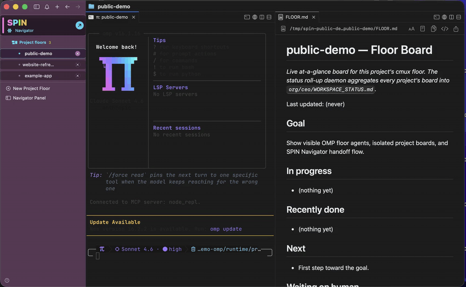

<div align="center">


# SPIN

### AI agent command center for Mac

**Coordinate AI coding agents across multiple software projects from one visual workspace. SPIN keeps every project isolated, routes work through OMP, and makes handoffs, approvals, and results easy to inspect.**

[](https://github.com/claudiaclawdbot/spin/actions/workflows/ci.yml)
[](https://github.com/claudiaclawdbot/spin/actions/workflows/macos-app.yml)
[](https://claudiaclawdbot.github.io/spin/)
[](LICENSE)


**[Download SPIN for Mac](https://github.com/claudiaclawdbot/spin/releases/tag/v4.1.0-beta.4)** | **[Install guide](docs/INSTALL_MACOS.md)** | **[Product site](https://claudiaclawdbot.github.io/spin/)**

</div>

<p align="center">
  
</p>

<p align="center">
  <a href="docs/assets/spin-public-beta-demo.mp4">Watch the short product demo</a>
</p>

## Overview

SPIN is a local orchestration app for developers, founders, and small product
teams running AI-assisted work across more than one codebase. It replaces a
collection of unrelated terminal sessions with a single operating model:

- **Navigator:** portfolio-level routing, priorities, approvals, and status.
- **Project workspaces:** one repository, context, queue, and agent lane per project.
- **Persistent execution:** supervised background jobs that continue independently of a visible terminal pane.
- **Model routing:** OMP provider roles, retry policy, and fallback across configured accounts.
- **Verifiable work:** file-backed handoffs, boards, receipts, and history.

SPIN for Mac packages a SPIN-branded [cmux](https://github.com/manaflow-ai/cmux)
workspace, [oh-my-pi](https://omp.sh) (`omp`), and the SPIN runtime in one app.
Provider accounts, source repositories, GitHub authentication, and standard
developer tools remain under the operator's control.

## Why SPIN

Coding agents work best with a clear objective and a focused repository
context. Running several agents across several products creates a different
problem: routing work, preserving context, tracking blockers, collecting
results, and choosing the right model for each job.

SPIN handles that coordination layer without merging every project into one
large prompt. Each project keeps its own working context. The Navigator keeps
the portfolio view and delegates work into the correct project workspace.

## Core Workflow

1. Add existing repositories or create new projects during onboarding.
2. Set priorities and delegate work from the Navigator.
3. Let each OMP-backed project agent work inside its own repository context.
4. Follow live boards, queues, receipts, and blockers from the SPIN workspace.
5. Review only actions that cross configured approval boundaries.

Before a handoff reaches a project agent, SPIN expands it into an execution
brief with the objective, relevant paths, constraints, acceptance checks, and
reporting requirements. This keeps delegation consistent without forcing every
project to share the Navigator's full context.

## Interoperability

The name stands for **Super Pi Interoperable Navigator**. Interoperability has
two practical meanings in SPIN:

- **Across projects:** isolated project agents coordinate through durable queues,
  handoffs, receipts, and Navigator decisions.
- **Across models and providers:** OMP manages account authentication, model
  roles, provider order, retries, and fallback for the services configured on
  the machine.

Project coordination is the primary product layer. Model and provider routing
keeps that layer from depending on a single vendor, model, CLI, or quota window.

## Download SPIN For Mac

The current release is [SPIN for Mac 4.1.0 Beta 4](https://github.com/claudiaclawdbot/spin/releases/tag/v4.1.0-beta.4).

Requirements:

- Apple silicon Mac
- macOS 13 or later
- At least one model/provider account supported by OMP
- Git and the normal development tools required by the projects being managed

Install:

1. Download the DMG from the release page.
2. Open it and drag `SPIN.app` into Applications.
3. Open SPIN and complete onboarding.

The current public beta is ad-hoc signed and not Apple-notarized. macOS may
require Control-clicking `SPIN.app` and selecting **Open** on first launch. The
[Mac install guide](docs/INSTALL_MACOS.md) includes checksum verification and
first-launch troubleshooting.

## What Is Included

| Component | Purpose |
|---|---|
| **SPIN.app** | Native product shell, onboarding, health checks, updates, and workspace launch |
| **cmux-derived workspace** | Project tabs, terminals, boards, and socket control |
| **OMP/Pi** | Agent sessions, model selection, provider authentication, retry, and fallback |
| **SPIN runtime** | Project registry, delegation, approvals, queues, receipts, and supervision |

## Navigator And Project Workspaces

The Navigator stays above the project workspaces and owns cross-project state.
It can create projects, route work, refine handoffs, monitor execution, and
surface decisions that need attention.

Every project workspace has its own:

- repository and working directory;
- OMP session and model context;
- queue, status, and live board;
- handoff, inbox, and receipt history.

That separation keeps project-specific instructions and implementation details
from leaking into unrelated work.

## Model And Provider Routing

OMP is the primary agent and provider engine. SPIN writes a runtime overlay for:

- `modelRoles` for default, small, slow, planning, and task work;
- `modelProviderOrder` across authenticated providers;
- `retry.fallbackChains` for quota, rate, server, and network failures.

Configured lanes may include OpenAI Codex, Anthropic, OpenRouter, Gemini, or
local runtimes. Direct vendor CLIs are an outer fallback when OMP is unavailable
or hard-fails; they are not the primary project-workspace path.

## Computer Use

When Codex Computer Use is installed, SPIN can delegate bounded desktop work to
the signed Codex CLI. Codex owns its supported plugin wrapper and native service
trust chain. SPIN keeps this integration explicit and testable:

```bash
spin doctor
spin computer-use probe
```

`spin doctor` reports configuration state. `spin computer-use probe` performs a
read-only live check before the desktop lane is treated as ready.

## Local Control And Approvals

SPIN runs with the permissions of the current macOS or Linux account. It is not
an operating-system sandbox. Provider credentials remain in OMP or the
provider's normal CLI configuration and should never be committed to a project.

The default action policy denies four categories of action:

1. External communication, including email, messages, forms, and public posts.
2. New spending, purchases, wallet transactions, or paid API usage.
3. Production deployment or release actions.
4. Protected branch pushes and protected repositories.

Local, reversible work can continue without interrupting the operator. For the
four categories above, `spin action` only runs exact commands and targets that
the owner enabled in `org/ACTION_POLICY.json`; otherwise it records a structured
request. Broker events and receipts remain in local runtime state. This is a
user-space control, not a substitute for OS-level credential isolation.

## App Updates

SPIN verifies downloaded release artifacts before replacing app-owned code:

```bash
spin app-updates --check --candidate ~/Downloads/SPIN-<version>-macos-arm64.dmg
spin app-updates --install --yes --allow-test-builds \
  --candidate ~/Downloads/SPIN-<version>-macos-arm64.dmg
```

The updater checks compatibility metadata, preserves local runtime state,
creates a backup, and writes rollback metadata. The current beta does not fetch
or install releases automatically; download the candidate DMG first.

## Documentation

- [Install SPIN for Mac](docs/INSTALL_MACOS.md)
- [Architecture](docs/ARCHITECTURE.md)
- [App bundle and release verification](docs/APP_BUNDLE.md)
- [Security policy](SECURITY.md)
- [Upgrade and rollback](docs/UPGRADING.md)
- [Product roadmap](docs/ROADMAP.md)
- [macOS release process](docs/RELEASING_MACOS.md)

## Source And CLI Setup

The source lane supports Linux, headless operation, automation, debugging, app
development, and recovery. It is not required for the standard Mac install.

Requirements:

- macOS or Linux
- `bash` and `node`
- `omp`, or a supported direct fallback CLI on `PATH`
- `cmux` for the visual workspace outside the packaged Mac app

Install from source:

```bash
git clone https://github.com/claudiaclawdbot/spin.git ~/spin
cd ~/spin
./install.sh

spin init
spin
```

Bootstrap installer:

```bash
curl -fsSL https://raw.githubusercontent.com/claudiaclawdbot/spin/main/spin-bootstrap.sh | bash
```

Review remote scripts before running them. An offline single-file installer is
also available as [`spin-offline.sh`](spin-offline.sh).

### Source Updates

```bash
spin update --check
spin update --dry-run
spin update
spin version
```

The updater refuses to run over local edits or active project jobs, backs up
runtime state, fast-forwards the checkout, applies migrations, runs
`spin doctor`, and restores supervision.

### CLI Commands

```text
spin                 show projects, approvals, blockers, and recent activity
spin watch           open the live terminal dashboard
spin web             open the local browser control panel
spin approve "<x>"   approve a queued action
spin decline "<x>"   decline or hold a queued action
spin ask "<q>"       send an asynchronous request to the Navigator
spin delegate --wait <project> "<task>"
spin action status | check | request | execute
spin start | stop    start or pause the Navigator loop
spin up | down       launch or close project workspaces and services
spin service status  verify driver, board, and workspace supervision
spin doctor          run the system health check
```

The `org` CLI is the validated state-change interface used by agents and
automation:

```text
org queue-job <project> <type> "<description>" [--max-runtime SEC] [--resource-class normal|heavy]
org set-handoff <project>
org set-state <project> --status S --next "..."
org escalate "<item>"
org process-approval <selection> <approve|decline|ask> --note "..."
org receipt
org inbox <project> "<message>"
org show
```

Every state-changing command validates input, acquires a lock, writes
atomically, and preserves append-only history where history matters.

## Architecture

SPIN is intentionally composed from small, inspectable layers:

| Layer | Responsibility |
|---|---|
| SPIN for Mac / `spin` CLI | Product entry point and control surface |
| Navigator | Portfolio priorities, routing, approvals, and supervision |
| Project workspaces | One OMP orchestrator and context per repository |
| Workers | Bounded agent invocations for individual jobs |
| File-backed runtime | Queues, state, handoffs, inboxes, and receipts |

The runtime does not require a database or message broker. Shared state lives in
plain files under the SPIN runtime and changes through checked CLI operations.

Key reliability controls include duplicate-loop prevention, change-gated model
calls, provider benching, retry and fallback policy, job timeouts, append-only
receipts, and an explicit stop control.

## Repository Layout

```text
app/                  Mac app shell, cmux configuration, and bundle templates
agent/                OMP/Pi-derived agent runtime home
assets/branding/      SPIN product assets
docs/                 product, architecture, security, and release documentation
install.sh            source checkout installer
scripts/              runtime, health, update, release, and org CLIs
org/                  seed state for source installs and app runtimes
runtime/              runtime migration notes
```

## Acknowledgments

SPIN builds on [oh-my-pi](https://omp.sh),
[cmux](https://github.com/manaflow-ai/cmux),
[Ghostty](https://ghostty.org),
[OpenAI Codex](https://github.com/openai/codex),
[Claude Code](https://claude.com/claude-code),
[Gemini CLI](https://github.com/google-gemini/gemini-cli),
[Ollama](https://ollama.com), and [OpenRouter](https://openrouter.ai).

## License

SPIN source in this repository is available under the [MIT License](LICENSE).
Bundled and upstream components retain their own licenses and notices. Public
Mac release assets include the corresponding source required for the bundled
cmux-derived component.
